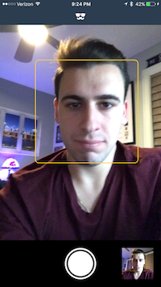

# **Faces**

Faces is an iPhone app that can highlight faces using OpenCV as well as saving images of those highlighted faces to the documents directory.

**App performance has only been tested on iPhone 7 Plus**

You can download the OpenCV framework for iOS [here]
